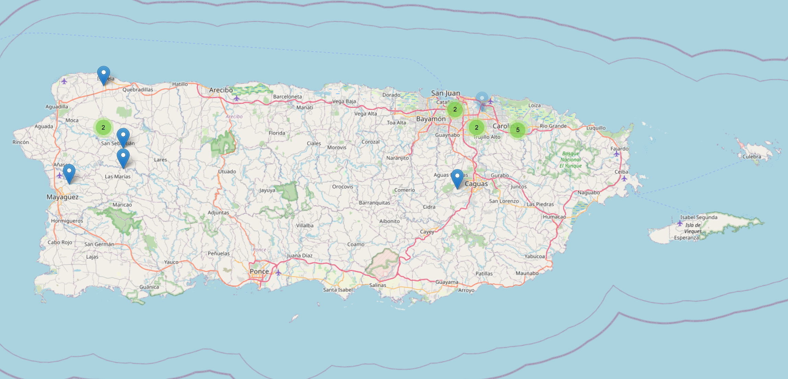

# 👋 Welcome to the Meshtastic Community of Puerto Rico

We’re building a resilient, decentralized communication network across Puerto Rico using **Meshtastic** — an open-source project that enables long-range, off-grid messaging via LoRa radios.

Whether you're a curious beginner, a radio enthusiast, or a community member preparing for emergencies, this site will help you get connected.

---

## 🗺️ Map of Puerto Rico Nodes

Below is a snapshot of our growing network across the island.

> 📝 *Want to add your node? Check out our [Guides](guides.md) section.*

---

## 📡 Want to Learn More About Meshtastic?

Meshtastic is a global open-source project built by a passionate community of developers and makers.

👉 [Click here to visit the official Meshtastic site](https://meshtastic.org)

---

Together, we’re building a smarter, stronger, and more connected Puerto Rico — one node at a time.

> 🛰️ _Connected by radios. United by community._
